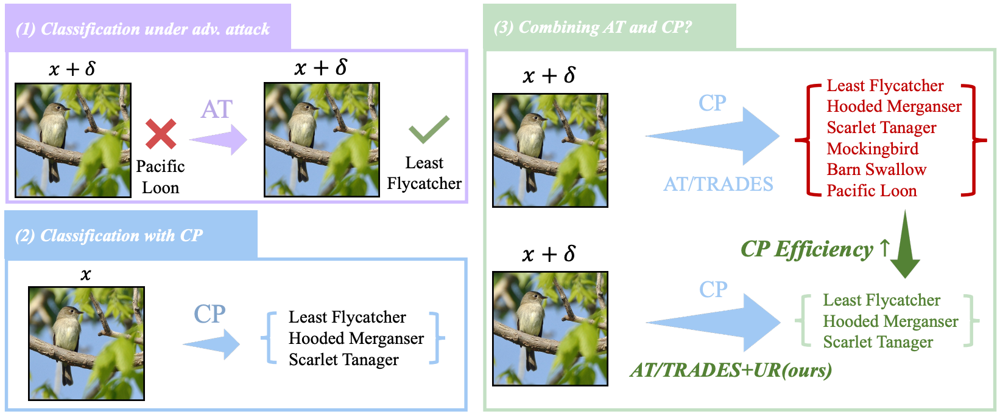

# ICML2024-AT-UR
Code for ICML2024 paper "The Pitfalls and Promise of Conformal Inference Under Adversarial Attacks"

# The Pitfalls and Promise of Conformal Inference Under Adversarial Attacks


## Abstract

> **The Pitfalls and Promise of Conformal Inference Under Adversarial Attacks**<br>
Ziquan Liu, Yufei Cui, Yan Yan, Yi Xu, Xiangyang Ji, Xue Liu, Antoni B. Chan<br>
> **Abstract**: In safety-critical applications such as medical imaging and autonomous driving, where decisions have profound implications for patient health and road safety, it is imperative to maintain both high adversarial robustness to protect against potential adversarial attacks and reliable uncertainty quantification in decision-making. With extensive research focused on enhancing adversarial robustness through various forms of adversarial training (AT), a notable knowledge gap remains concerning the uncertainty inherent in adversarially trained models. To address this gap, this study investigates the uncertainty of deep learning models by examining the performance of conformal prediction (CP) in the context of standard adversarial attacks within the adversarial defense community. It is first unveiled that existing CP methods do not produce informative prediction sets under the commonly used $l_{\infty}$-norm bounded attack if the model is not adversarially trained, which underpins the importance of adversarial training for CP. Our paper next demonstrates that the prediction set size (PSS) of CP using adversarially trained models with AT variants is often worse than using standard AT, inspiring us to research into CP-efficient AT for improved PSS. We propose to optimize a Beta-weighting loss with an entropy minimization regularizer during AT to improve CP-efficiency, where the Beta-weighting loss is shown to be an upper bound of PSS at the population level by our theoretical analysis. Moreover, our empirical study on four image classification across three popular AT baselines datasets validates the effectiveness of the proposed Uncertainty-Reducing AT (AT-UR).



> The proposed uncertainty-reducing adversarial training (AT-UR) improves the CP-efficiency of existing adversarial training
methods like AT, FAT and TRADES. (1) AT improves the Top-1 robust accuracy of a standard model; (2) CP generates a prediction set
with a pre-specified coverage guarantee for an input image, but for models not adversarially trained, CP fails to generate informative
prediction sets, as the PSS is almost the same as the class number, when models being attacked (Fig. 2); (3) When using CP in an
adversarially trained model, the prediction set size is generally large, leading to inefficient CP. Our AT-UR substantially improves the
CP-efficiency of existing AT methods.


## Install

First, please install the necessary dependencies:

```bash
pip install -r requirements.txt
```

## Usage

### AT-Beta, AT-EM and AT-Beta-EM

```python
# run the following code

```

## Experiment

## Citation

If you find our work useful, please consider citing our paper:

```bibtex
@inproceedings{
liu2024pitfalls,
title={The Pitfalls and Promise of Conformal Inference Under Adversarial Attacks},
author={Ziquan Liu and Yufei Cui and Yan Yan and Yi Xu and Xiangyang Ji and Xue Liu and Antoni B. Chan},
booktitle={Forty-first International Conference on Machine Learning},
year={2024}
}
```

## Contact

**Please feel free to get in touch at**: `ziquanliu.cs@gmail.com`
